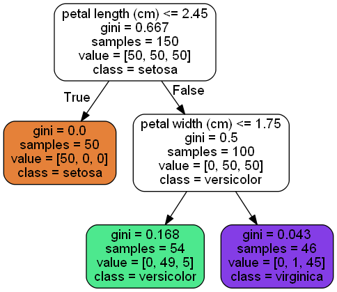

### Decision Trees
- Decision trees are built as a graph, made up of 
  * Leaf Nodes: nodes with no further nodes below it.
  * Split Nodes: a node that will split into further nodes. Typically 2 nodes (True/False) if trained using the CART algorithm
  * Root Node: The node representing the start of the decision tree. 
- Each node in the decision tree has a set of values:
  * A Feature condition: typically this is just a feature and a condition placed on it that results in a boolean response. eg: X <= 50, or X == “3 Bedrooms”, 
  * Samples:  Number of datapoints in training dataset that fall into that node. 
  * Class: Of the classes in our dataset, each node will represent one of these. That way every truth node below will correspond to that class. 
  * Values: a vector representing of all the datapoints in the “Sample” ie, belonging to that node, what classes do they actually belong to. Based on this, every node below a particular node should only have classes that are in that node. 
  * Gini: A measure of the impurity of the node. In an ideal world we’d have every leaf node would have the “values” vector as belonging to only 1 class. A purity is a measure of close we are to this, if we have a high Gini, then we’re quite impure, a Gini of 0 means the node is pure. 
- 
* Now that we know what Gini is, we can use is to train a decision tree using a Greedy Algorithm. 
  * We start by choosing a feature (k) and a value (t_k) such that the pair produces the purest possible subsets. Purity is provided as a weighted average across the 2 child nodes: weights being the % of datapoints in each node and the Gini for each node. 
  * The algorithm will keep doing this to each node, this is possible as each node has a “Sample” of datapoints that land in that node. If that node is not pure then we try to split further using the same approach. 
  * We expect that each node below a particular node should have a smaller Gini. 
  * We can quantify the Gini of the entire model by summing the Gini of all the leaf nodes.
* This approach is a Greedy approach as at each stage we choose the best possible split, but this doesn’t necessarily imply the entire model is the purest. 
* Finding a perfect solution for a decision tree is an O(exp(m)) (m=no. of datapoints), (Non-polynomial time) and hence a Greedy option is sufficient. 
* There are 2 ways of measuring purity: Gini and Entropy. For the most part Gini is fine and faster at converging. 
* Decision trees can be thought of as non-parametric as unlike LogReg for example, there are no parameters to really optimise. 
* Decision trees are great because they don’t require any feature scaling - (no gradient descent etc) and they make intuitive sense
* Regularisation Parameters: if we think about a decision tree, in theory it could keep on growing as I’m sure we can use all features, and keep reducing the purity (essentially overfitting). Thus the need for regularisation parameters are needed to prevent overfitting. 
  * Max Features: Fixing the number of features used in the decision tree, so less important ones aren’t included. 
  * Max Leaf Nodes: Intuitively, the maximum number of leaf nodes. 
  * Min Samples Split: Minimum number of samples a node must have to be split. 
  * Min Samples Leaf: Minimum number of samples a leaf node needs to be created. 
* Decision Trees can also be pruned, cutting branches if they don’t statistically improve the purity of the model. 
* Decision trees can have a high variance. This is because for example the feature selection at each node is random and the class on the false node is also random etc. Given these random components even using the same data can lead to a different looking decision tree. As variance is a measure of “how quickly does my model change, if the input data changes. 
* Decision trees can also be regressors, similar to how a decision tree as a classifier is trained, each leaf node will have a subset of the training dataset. In the regressor case, we take the average of the samples belonging to that leaf node. 