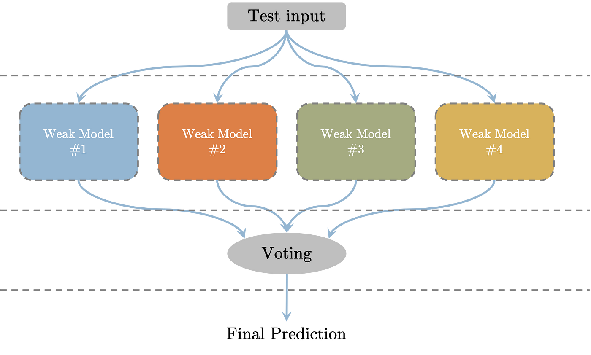

### Ensembles:

* Ensembling is the technique of building a classifer/regressor which combines multiple models. 
* An intuitive case is a Random Forest, which like a forest is built up of multiple trees, in particular decision trees. 
* Ensembling methods predict by taking a datapoint, passing it through each predictor/model within the ensemble. Then uses some aggregation method applied to all of the outputs, one example is the statistical Mode. Ie: whichever class is predicted the most, the model will predict that. 
* The idea behind ensemble methods is it can combine the responses from multiple weak models to form a strong model. 
* Consider the following stats: If a coin has a 51% chance of HEAD, coin is tossed N times, X be RV denoting number of heads, Y is RV denoting number of tails. The P(X>Y) converges to 1 as N gets larger. Extending this idea to ensemble methods, if each models is ever so slightly better than random, then across multiple models we’re more likely to have predicted the correct output. However, the underlying assumption in the coin toss example, is that the tosses are independent. In the Ensemble method case, predictions aren’t necessarily independent as similar trained models are likely to have the same errors. That’s why it’s important to use a large number of models/a variety of models. (KNN’s, SVM’s,. LogReg etc). 
* 
* The above depicts a voting classifier, where the class with the highest votes is the predicted class.

### Bagging/Pasting
* Bagging/Pasting Classifier: The idea behind a bagging classifier is pass a random sample of the training dataset to each model in the ensemble. Bagging is the approach of sampling datapoints with replacement, pasting is without replacement. 
* In Bagging if we have m training datapoints, we sample m datapoints with replacement for each predictor. The math behind this is each predictor will receive around 63% of the training dataset, and each model will receive a different 63%. This allows each model to have a higher bias than if a model were to be trained on the entire training dataset. (Ie will be underfit), thus each model has a lower variance.Thus when considering the ensemble method, it combines high bias/low variance models to produce a model that has a similar bias (to just one complete model) but a lower variance. Essentially harder to overfit as each model still only receives a sample of the dataset.
* In Pasting, if we have m training datapoints, we sample x datapoints without replacement; where x<=m. 
* If we’re using bagging, we don’t even need a cross validation set really. A CV dataset should be a dataset that the general model hasn’t seen. Above we mentioned that each predictor gets around 63% of training instances (because we have sampling with replacement), therefore the other 37% of datapoints are Out-of-Bag datapoints for that predictor, ie that predictor hasn’t seen those datapoints. It’s likely that if we take a fixed datapoint in our training dataset, it will be OOB for many predictors, so to test our Ensemble model, we pass this datapoint to all the predictors that it is an OOB datapoint, to generate it’s predicted label. We can do this for every datapoint - then for each datapoint, we have its actual label, and it’s predicted label so we can work out any keys metrics on the CV set. 
* When building bagging/pasting models, we can train them in parallel, allowing for quick model building. 

### Random Forests:
- We spoke about how bagging randomly samples datapoints, but Random Patches is a technique where the features are also randomly sampled. Again, the bias of each model will increase as we may choose features that have little predictability but we gain computational speed and across multiple models the high bias will cancel out. (Good for high dimensional data).
- There’s another technique called Random Subspaces, takes a subspace of the feature space (ie samples features randomly) but uses the entire training dataset on each predictor. 
- We can now introduce Random Forests formally. Previously we mentioned how they are a collection of decision trees. Essentially Bagging with each predictor being a decision tree.
- We want to use the RandomForest classifier in Python instead of bagging as it’s built for decision trees as the predictors. 
- However the Random forest, introduces some randomness that we’ve discussed, for each decision tree predictor, it samples sqrt(N) features and each node, instead of choosing the feature that gives the smallest Gini/impurity, it will randomly sample the feature. Again, doing some increases the bias, but lowers the overall variance. 
- To go even further there’s a model called “Extremely randomised Ensemble” where each node in each decision tree has a random feature sampled from a subset like in an RF, but also a random threshold. This randomness means training can be super quick as no longer need to find the threshold that gives the purest subsets. 
- Random Forests are also great because they can give an idea of feature importance. We can think of a the purity of a decision tree, as the sum of the Gini/Entropy of all nodes. Introducing a new feature to an existing leaf node, means that by splitting, we’re hoping for a decrease in Gini/impurity. A random forest can measure the importance of a feature by taking a weighted average of the decrease in Gini/impurity for all nodes that use that feature. 