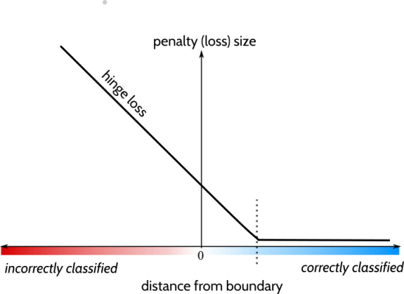
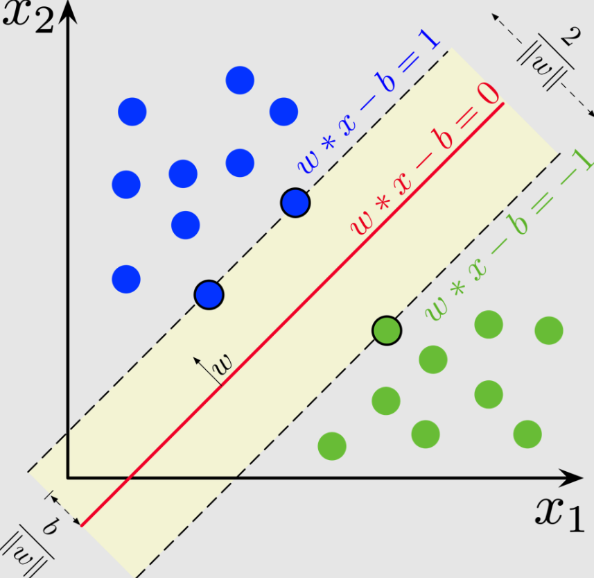

### Support Vector Machines: 

- Logistic regression is great but we want our trained model to generalise well too. Think of a dataset with 2 data points: (0,0) with label 1 and (1,0) with label 0. Can use the line x=0.5 and x=0.000001, both lines clearly seperate the classes however one can argue that the x=0.5 model generalises better. 
- If data points are close to a decision boundary it allows more room for misclassification and hence the model may not generalise as well. 
- SVM good for small to medium sized datasets. 
- This is where a SVM comes in, a support vector machine tries to fit a plane between the 2 datasets but we can think of a SVM as 3 lines, middle line being decision boundary and 2 other lines forming a “road”. The idea is we want to create a model with the largest road/street as this allows the model to generalise better. However notice that a larger street allows for a greater area in which points can be misclassified. 
- The SVM tries to use datapoints to create the widest street possible. However not all datapoints are used, only the one that’s are closest to the line are used to fit the model. These are called Support Vectors. 
- No datapoints should lie on the road/in the middle of the street. As again the point is we want a street which as far away from the support vectors as possible. Ie being far from the support vectors allows for a better general model. 
- We have a regularisation parameter --C--, which when reduced will allow a wider street. In turn a wider street means less chance of overfitting. Remember overfitting can be thought of as not generalising well. 
- SVM’s also need feature scaling as they are sensitive to scale. 
- Again reiterating, SVMs try to seperate classes with a plane, so this still only solves linear problems. However we can get around this:
  - By creating Polynomial features - similar to linear regression. This method of adding polynomial features can be computationally expensive, so we can use the “Kernel Trick” (will explain further below) but this allows us to try polynomial features without the computational difficulty.
  - Another technique for non-linear problems is to use a similarity technique. We pick a landmark which is a point in our feature space (typically this is one of the datapoints). If a datapoint is x, we define a new feature: x_new = similarity(landmark, x). Typically we would create features for each of the datapoints in the training dataset by creating a new feature where the landmark is a datapoint. This results in an m x m feature matrix, where m is number of datapoints. Thus we have to be careful with regards to computational efficiency. 
- You can use SVM’s for regression also, which will try to fit a line that balances the number of data points on either side off the street, and yet still generalises well by having a street of largest width.
- Classifying with SVM’s is simple, if theta • x >= 0 then assign class 1, else 0. Exactly the same as Logistic regression. 
- Solving SVM’s:
  - The goal of support vector machines is to fit a line between classes while maximising the width (so it generalises well). The width of the street is 2/w^Tw, hence this corresponds to minimising the norm of the weight vector. Ie: minimising w^Tw. 
  - With SVMs we can have hard or soft margin classification. Hard forces all classes to be linearly separable and none on the street, soft margin is a relaxation on this and allows some points to be on the wrong side/on the street. 
  - Both of these margin conditions can be placed into constrained optimisation problems, this is called the Primal problem. To solve this, we can convert the primal problem into a dual problem(also constrained optimisation), which is easier to solve, provides an estimate of the unbounded error of the primal problem. 
  - Solving the dual problem is especially quick when the number of instances is less than the number of features. This is why SVM’s aren’t particularly efficient on large datasets. 
  - Support vector machines use Kernels to deal with non-linearity. We know just like linear regression we can add non-linear features; which is the equivalent of applying a transformation on the features. 
  - The dual problem involves the term x^i • x^j. So if we apply a transformation (phi) need to workout phi(x^i) • phi (x^j) for all possible datapoints. This is computationally expensive. 
  - The kernel trick is to apply a real valued function K(a,b) which can easily be written/computed. Mercer’s Theorem states that if K satisfies some conditions then there exists some phi st K(a,b) = phi(a) • phi(b). This way in the dual problem, instead of having to work out phi(x^i) • phi(x^j), we can just workout K(a,b). Kernels allow us to work out dot products of fancy functions without even knowing what the fancy function is. 
  - Kernels are a way of introducing non-linearity into problems while maintaining computational complexity. Say we wanted to introduce 2nd degree features, We would have to apply the transformation, solve the dual problem. Using the kernel trick, we can skip having to initially applying the transformation and store the new features in memory. We simply solve the dual problem which is modified and we can work out the dot product very easily as we have the Kernel. 
- We can also use Stochastic Gradient descent to work out the optimal parameters. Here we use the Hinge Loss or the Squared Hinge Loss. The hinge loss for a datapoint is dependent on the class the datapoint belongs to. If the class is 1, then the loss is 0 if theta • x >= 1, and is some straight line if theta • x <= 1, then the loss is some value based on some straight line. Squared hinge loss is the equivalent but a quadratic function. Similarly the graph is reflected is the class is 0. 
  

- This idea is rather intuitive, if a datapoint is off the street, then this means theta • x >=1 so contributes nothing to the hinge loss. If within the street or really close to the street, these introduce a small hinge loss. If overfit, then most data points are off the street and hence small hinge loss. We want a small amount of error that is introduced by the support vectors.

